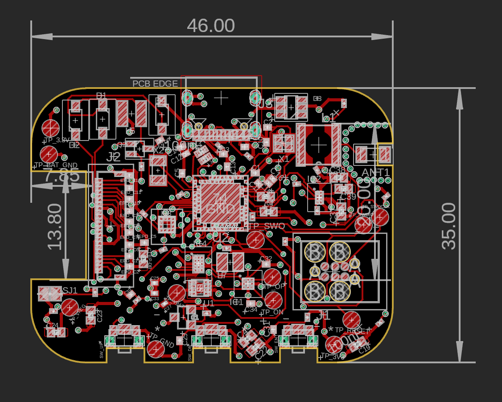
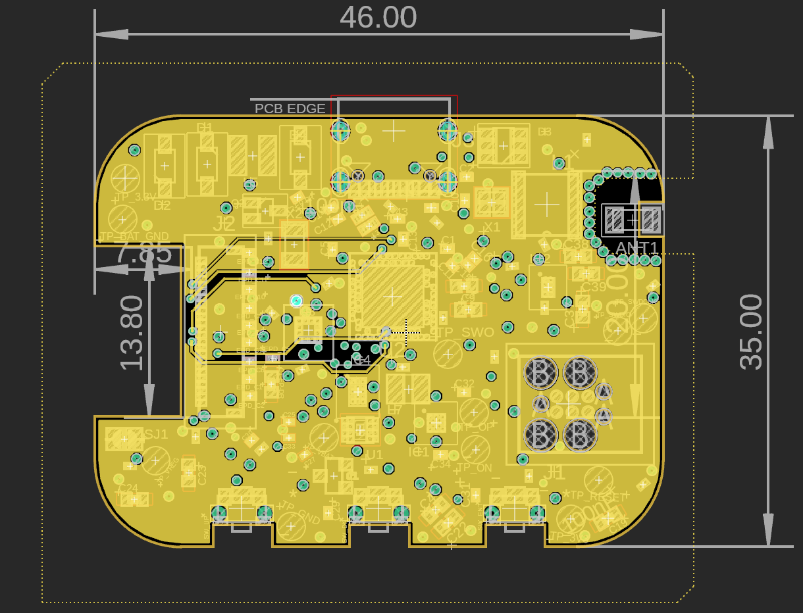
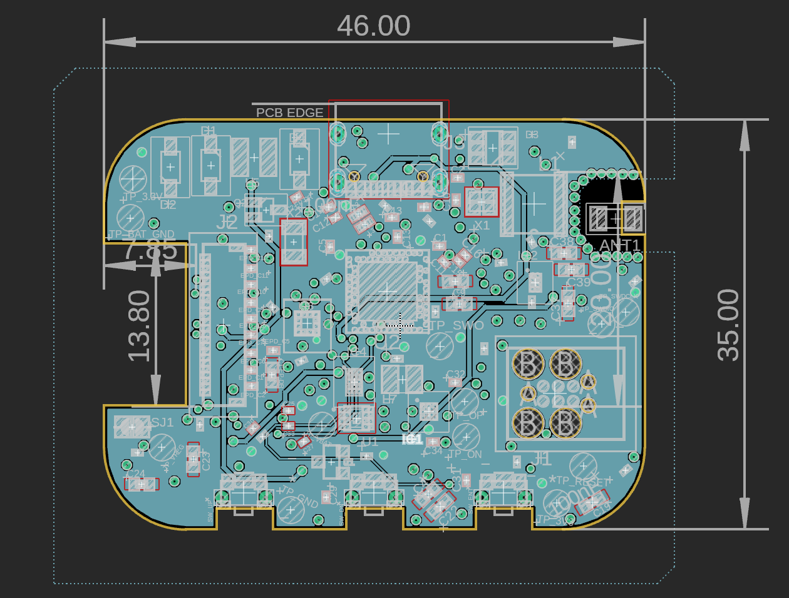
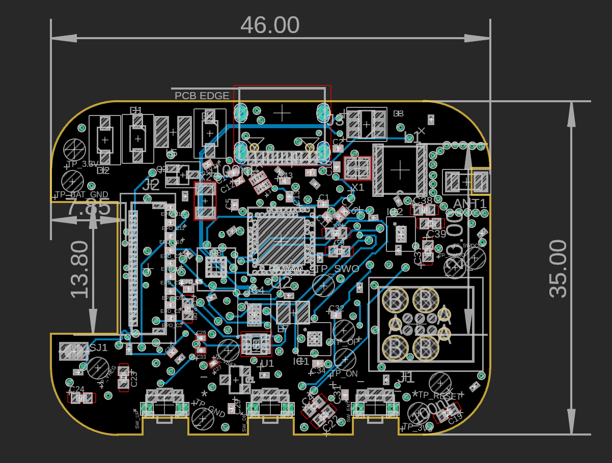

# InkTime Smartwatch
<video controls width="550">
  <source src=".\Mechanical\exploding_view.mp4" type="video/mp4">
  Your browser does not support the video tag.
</video>

### Main components:
<ol>
    <li><b>MCU</b></li>
        <i>component</i>: nFR52840-QIAA  
        <i>connectivity</i>: its mandatory connections for proper functioning are the VDD 
        and VDDH(for normal-voltage mode) and a VSS with pad exposure for 
        electrical connectivity testing  
        <i>placement</i>: the MCU is centered horizontally and vertically; additionally 
        it is equidistant to most ICs in order to optimize the signals and power train. 
        There are seldom unoptimised-length signal wires or wires on other layers
        optimized for both signal and power train to e
        <i>decoupling</i>: here we have 3 smaller capacitors for power decoupling 
        connected on pin DEC1(100nF to GND) and pins DEC4 & DEC6(1uF to GND)  
        <i>clock</i>: the clock  is determined as it follows: 32MHz between CX1/XC2 and 32.768KHz between XL1/XL2. The crystal oscillators were placed 
        as close as possible to the MCU
    <li><b>Accelerometer</b></li>
        <i>component</i>: BMA421
        <i>connectivity:</i> connected on the I2C bus to the MCU; has 
        low power mode logic for embedded systems power usage; thus, it wakes 
        when pin IN1 triggers as to eliminate busy waiting on signal; additionally 
        there's INT2 pin for debugging that may be consulted furthermore via the JTAG
    <li><b>Haptics</b></li>
        <i>component:</i>: DRV2605L
        <i>placement</i>: as to avoid vibrations to trigger walking mode, a key trait 
        taken into consideration at PCB design stage was the distance between the haptics
        driver and accelerometer which is approximately half of the board's width between 
        the two of them. 
        <i>power stage:</i> it is following the Richtek recommended values 
        inductor/capacitor: 0.47uH, multi-22uF input and 10uF output
    <li><b>Fuel Gauge</b></li>
        <i>component</i>: the MAX17048
        <i>placement</i>: in the middle-bottom part of the board
        <i>functionality</i>: it is meant to trigger on ALRT through interrupts 
        when the functioning voltage should lower to VDD_3V3 value as for battery saving
    <li><b>E-paper Display</b></li>
        <i>component</i>: 503480-2400
        <i>connectivity</i>: unlike points 2, 3 and 4, it is connected via SPI; 
        obviously, the display cannot be multiplexed with other IC devices, duhhhh.
        <i>placement</i>: it is placed on the very right side of the board; for low
        latency I chose to wire the SPI interface via the power layer for a resonably
        short distance to the MCU pins.
</ol>

### USB
<i>placement</i>: the usb is placed on the top side of the board, accurately snaped to the
watch case slot for the USB connection.  
<i>wiring</i>: for the differential wires of the USB, a very accurate and exhaustive routing has been 
undergone. Case in point, D- and D+ have been 95% equidistant and perserve the length 
and width all way long.

### I2C address mapping
Address mapping(7-bit addresses) on the I2C interface:
<ul>
<li>BMA421: 0x18 - accelerometer</li>
<li>MAX17048: 0x36 - </li>
<li>DRV2605L: 0x5A - haptics driver and ERM motor</li>
<li>BQ25180: 0x6A</li>
<li>RT6160: 0x75</li>
</ul>

### PCB Layout
<i>layers</I>: 4-layers for RF performance and power integrity
<ol>
<li> Signals - most of the signal are connected here; also few components are tied
together group by 2 or 3 on top before via stitching to the GND or power.</li>
  

<li> GND  - for preventing energy spikes at charging/powering decoupling capacitors 
have been spread all across the top layer tightly wired to the ICs</li>
  

<li> Power - main copper layer is tied to 3V3 signal; other values wired on this 
layer include as well: EPD_3V3, VREG, VBAT, VBUS; also P0.13 and p0.14 signal 
pins of the MCU are wired on this layer for PCB design simplicity reasons</li>
  

<li> Signals - plenty of I2C interface, charger connectivity and USB data 
are the main actors of the fourth layer out of the PCB</li>

</ol>

### RF functioning
The PCB is cropped on the upper part of the right side as for creating a slot for the 
antenna's pad. The copper layers for GND and POWER and cropper as well a few milimiters 
margin from the whole antenna. Moreover, vias have been placed all around the antenna. The noise and interference are preempted as possible from the footprint stage and 
placement.

### Software Stack
Recommended layers:
<pre>
1. Real-Time Operating-System(RTOS) for low latency 
    | providing  
    |  
    ----> 2. Drivers for I2C/SPI/GPIO  
            | providing  
            |  
            ----> 3. Services as power mng, BLE/UI, clocks 
                    and interrupts and refreshing/ghosting
</pre>
Suggestion: Zephyr OS for BLE maturity or any other monolithic kernels OSes suitable
for embedded devices